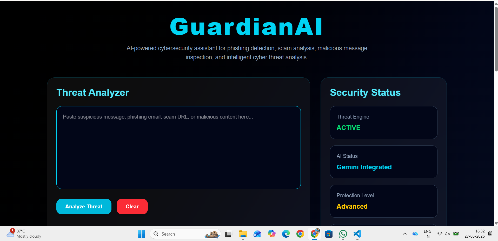

# 🛡️ GuardianAI — AI-Powered Cybersecurity Threat Detection Platform

GuardianAI is a full-stack AI-powered cybersecurity platform designed to detect phishing attempts, scam messages, malicious content, and suspicious cyber threats using advanced AI analysis and intelligent fallback detection systems.

---

# 🚀 Features

## 🔍 AI Threat Analysis
- Detects phishing attempts
- Identifies scam messages
- Detects credential theft attempts
- Analyzes suspicious cyber activity
- Intelligent risk categorization

---

## 🧠 Hybrid Threat Engine
GuardianAI uses:

### ✅ Gemini AI Engine
Advanced AI-based cybersecurity analysis.

### ✅ Local Fallback Engine
If AI quota/rate limits are exceeded:
- local threat detection still works
- application never crashes
- analysis remains functional

---

## 📊 Threat Risk Visualization
- HIGH / MEDIUM / LOW risk detection
- Dynamic cyber risk meter
- Color-coded security indicators
- Professional threat cards

---

## 🗄️ Scan History System
- SQLite database integration
- Persistent scan storage
- Historical threat tracking
- Cybersecurity activity logging

---

## 🎨 Professional Cyber Dashboard UI
- Glassmorphism UI
- Responsive design
- Tailwind CSS styling
- Framer Motion animations
- Enterprise SOC-inspired interface

---

# 🛠️ Tech Stack

## Frontend
- React.js
- Vite
- Tailwind CSS
- Framer Motion
- Axios

## Backend
- FastAPI
- Python
- SQLite

## AI
- Google Gemini API

---

# ⚙️ Installation Guide

## 1️⃣ Clone Repository

```bash
git clone https://github.com/Farha-01/GuardianAI-Cybersecurity-Platform.git
```

---

## 2️⃣ Backend Setup

```bash
cd Backend
```

Create virtual environment:

```bash
python -m venv venv
```

Activate venv:

### Windows
```bash
venv\Scripts\activate
```

Install dependencies:

```bash
pip install -r requirements.txt
```

Create `.env` file:

```env
GEMINI_API_KEY=YOUR_API_KEY
```

Run backend:

```bash
uvicorn main:app --reload
```

---

## 3️⃣ Frontend Setup

Open another terminal:

```bash
cd Frontend
```

Install dependencies:

```bash
npm install
```

Run frontend:

```bash
npm run dev
```

---


# 📸 Screenshots

## 🖥️ GuardianAI Dashboard



---

## 🚨 High Risk Threat Detection


---

## ✅ Low Risk Detection


---

## ⚠️ Medium Risk Detection


---

## 📊 Risk Score Meter


---

## 🗂️ Threat History


---

# 📈 Future Improvements

- 🔗 URL phishing scanner
- 📁 File upload scanning
- 📊 Analytics dashboard
- 🔐 User authentication
- ☁️ Cloud deployment
- 📄 PDF threat reports
- 🧠 Advanced AI models

---

# 🧪 Example Threat Inputs

## HIGH RISK
```txt
URGENT! Your bank account has been suspended. Send OTP immediately.
```

## LOW RISK
```txt
Hey, let's meet tomorrow at 5 PM.
```

---

# 👨‍💻 Author

## Shaik Farha

AI | Cybersecurity | Full-Stack Development

---

# ⭐ Support

If you liked this project:
- Star the repository
- Share feedback
- Connect on LinkedIn

---

# ⚠️ Disclaimer

GuardianAI is developed for educational, research, and cybersecurity awareness purposes only.